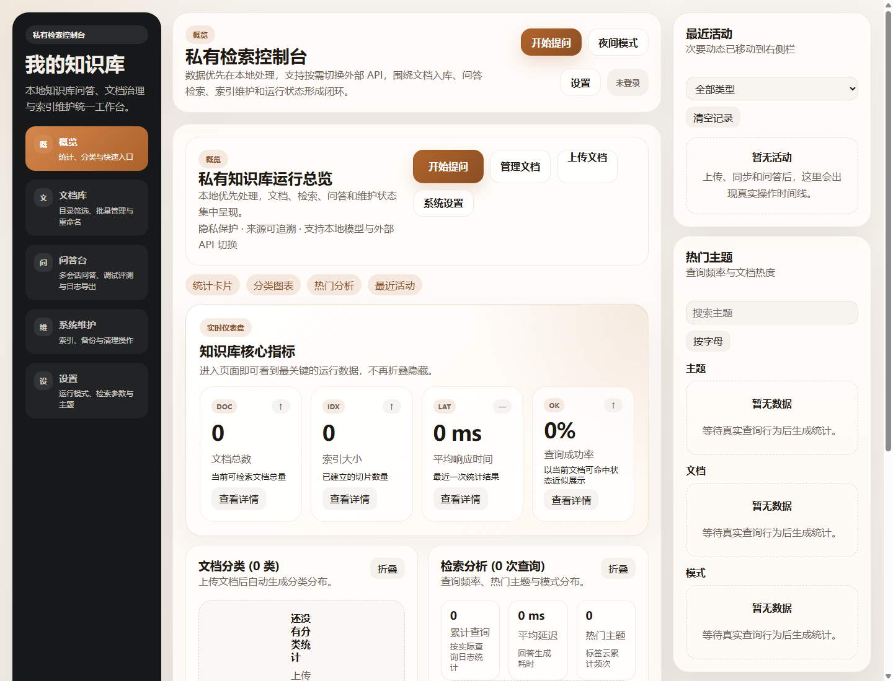

# private-rag-knowledge-base

一个支持本地运行与外部 API 切换的私有 RAG 知识库问答系统，提供文档上传、目录同步、向量检索、来源引用、多会话问答、检索调试、日志导出、数据分析、索引维护和备份恢复能力。

## 前端截图



## 核心能力

- 文档上传与本地目录同步，支持 `.md`、`.txt`、`.json`、`.pdf`、`.docx`、`.xlsx`、`.xlsm`。
- 支持精确检索、语义搜索、混合检索。
- 问答台支持多会话、分类/目录过滤、Top-K、查询改写、来源引用和原文打开。
- 支持检索调试、检索评测、查询日志导出。
- 支持登录鉴权，演示账号包含管理员、分析员和审计员。
- 支持文档关系图、查询频率、热门主题、系统资源指标等分析视图。
- 支持索引重建、备份导出、备份版本创建、校验、恢复、去重和孤儿文件清理。
- 支持本地 template/hash embedding 模式，也支持 OpenAI 兼容的 Embedding / Chat Completions API。

## 技术栈

- 后端：FastAPI、SQLAlchemy、SQLite
- 前端：React、TypeScript、Vite
- 本地检索：hashing embedding、本地全文检索
- 外部模型：OpenAI 兼容 Embedding / Chat Completions API

## 快速启动

安装后端依赖：

```powershell
python -m pip install -e .
```

安装前端依赖：

```powershell
cd frontend
npm install
```

启动后端：

```powershell
scripts\start_backend.bat
```

启动前端：

```powershell
scripts\start_frontend.bat
```

访问地址：

- 前端控制台：`http://127.0.0.1:5173`
- 后端接口文档：`http://127.0.0.1:8000/docs`

## 默认账号

- 管理员：`admin / rag-console`
- 分析员：`analyst / rag-analyst`
- 审计员：`auditor / rag-audit`

## 本地模式配置

```env
RAG_LOCAL_MODE_ENABLED=true
RAG_EMBEDDING_PROVIDER=hashing
RAG_EMBEDDING_DIMENSIONS=128
RAG_LLM_PROVIDER=template
```

本地模式可完整跑通 RAG 流程，不依赖外部 API。`template` 回答器适合离线验收和流程验证，不等同于高质量大模型生成。

## 外部 API 模式配置

```env
RAG_EMBEDDING_PROVIDER=openai-compatible
RAG_EMBEDDING_MODEL=text-embedding-3-small
RAG_EMBEDDING_DIMENSIONS=1536
RAG_EMBEDDING_API_KEY=your-key
RAG_EMBEDDING_BASE_URL=

RAG_LLM_PROVIDER=openai-compatible
RAG_LLM_MODEL=gpt-4o-mini
RAG_LLM_API_KEY=your-key
RAG_LLM_BASE_URL=
```

切换 Embedding 模型或向量维度后，建议重建索引或重新导入文档。

## 验证命令

```powershell
py -3 -m pytest tests -q

cd frontend
npm.cmd run build
```

## 项目边界

- 默认 SQLite 更适合单机本地使用；多人协作或生产部署建议切换 PostgreSQL。
- 文档关系图和热门主题当前基于分类、来源、关键词和查询日志统计，不是完整知识图谱推理。
- 本地 `template` 回答器适合离线验收；高质量问答建议接入外部 LLM。
