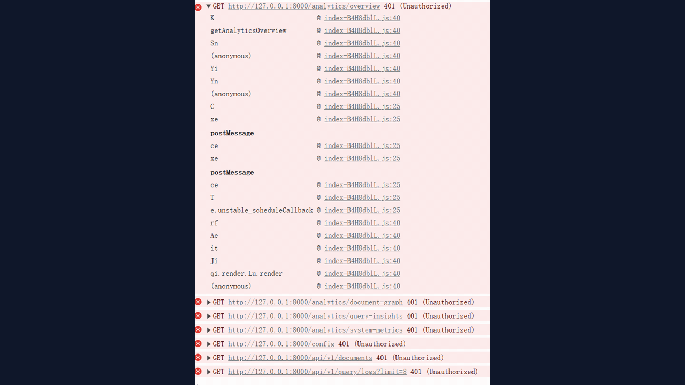

# private-rag-knowledge-base

一个可本地运行、可切换外部 API 的私有 RAG 知识库问答系统，包含文档入库、目录同步、检索问答、来源引用、调试评测、日志导出、索引维护和备份恢复能力。

## 项目定位

这个项目面向个人知识库、团队内部知识库和本地私有问答场景，重点解决：

- 文档统一入库与分类管理
- 基于私有数据的问答检索
- 回答来源可追踪
- 本地优先处理，支持隐私保护
- 可在本地模式和外部模型 API 模式之间切换

## 界面预览

### 控制台首页


### 界面演示



## 核心能力

- 文档上传、批量管理、重命名、分类、移动、删除
- 本地目录同步，支持 `.md`、`.txt`、`.json`、`.pdf`、`.docx`、`.xlsx`、`.xlsm`
- 问答台支持多会话问答、精确检索、语义检索、混合检索
- 支持来源引用、相关文档片段展示、检索调试和检索评测
- 支持查询日志查看与导出
- 支持知识库统计、文档关系图、热门主题、检索模式分布、系统资源指标
- 支持索引重建、备份导出、备份版本创建、校验、恢复、去重、孤儿文件清理
- 支持登录鉴权，适合受保护知识库场景

## 技术栈

- 后端：FastAPI、SQLAlchemy、SQLite / PostgreSQL
- 前端：React、TypeScript、Vite
- 检索：本地 hashing embedding、本地全文检索、混合检索管线
- 模型接入：OpenAI 兼容 Embedding / Chat Completions API

## 登录方式

前端访问后，先使用页面左侧登录框登录。

默认账号：

- 管理员：`admin / rag-console`
- 分析员：`analyst / rag-analyst`
- 审计员：`auditor / rag-audit`

## 快速启动

### 1. 安装后端依赖

```powershell
python -m pip install -e .
```

### 2. 安装前端依赖

```powershell
cd frontend
npm install
```

## 启动方式

### 方式一：本地开发模式

后端：

```powershell
scripts\start_backend.bat
```

前端：

```powershell
scripts\start_frontend.bat
```

访问地址：

- 前端：`http://127.0.0.1:5173`
- 后端文档：`http://127.0.0.1:8000/docs`

### 方式二：无 Docker 本地生产模式

预检：

```powershell
powershell -ExecutionPolicy Bypass -File scripts\preflight_local_production.ps1
```

启动：

```powershell
powershell -ExecutionPolicy Bypass -File scripts\start_local_production.ps1
```

停止：

```powershell
powershell -ExecutionPolicy Bypass -File scripts\stop_local_production.ps1
```

访问地址：

- 前端：`http://127.0.0.1:8080`
- 后端：`http://127.0.0.1:8000`
- 健康检查：`http://127.0.0.1:8000/health`

### 方式三：Docker 部署

如果本机 Docker 网络可正常访问 Docker Hub，可使用：

```powershell
docker compose up -d --build
```

如果需要启用 OpenSearch：

```powershell
docker compose --profile search up -d --build
```

说明：

- 当前仓库已修复默认 compose 下 `opensearch` profile 的依赖问题
- 如果 Docker 报 `lookup auth.docker.io: no such host`，那是 Docker 网络或 DNS 问题，不是项目代码问题

## 配置模式

### 本地模式

适合离线验证和本地私有知识库使用：

```env
RAG_LOCAL_MODE_ENABLED=true
RAG_EMBEDDING_PROVIDER=hashing
RAG_EMBEDDING_DIMENSIONS=128
RAG_LLM_PROVIDER=template
```

### 外部 API 模式

适合接入更高质量模型：

```env
RAG_EMBEDDING_PROVIDER=openai-compatible
RAG_EMBEDDING_MODEL=text-embedding-3-small
RAG_EMBEDDING_DIMENSIONS=1536
RAG_EMBEDDING_API_KEY=your-key
RAG_EMBEDDING_BASE_URL=

RAG_LLM_PROVIDER=openai-compatible
RAG_LLM_MODEL=gpt-4o-mini
RAG_LLM_API_KEY=your-key
RAG_LLM_BASE_URL=
```

切换 embedding 模型或向量维度后，建议重建索引或重新导入文档。

## 验证命令

后端测试：

```powershell
py -3 -m pytest tests -q
```

前端构建：

```powershell
cd frontend
npm.cmd run build
```

## 交付文档

- 部署运行手册：`docs/deployment-runbook.md`
- 交付验收清单：`docs/delivery-checklist.md`

## 生产化辅助脚本

- 生成生产环境模板：`scripts/prepare_production_env.ps1`
- Docker 生产预检：`scripts/preflight_production.ps1`
- 无 Docker 本地生产预检：`scripts/preflight_local_production.ps1`
- 无 Docker 本地生产启动：`scripts/start_local_production.ps1`
- 无 Docker 本地生产停止：`scripts/stop_local_production.ps1`

## 当前已落地范围

已经落地：

- 私有知识库前后端页面
- 登录鉴权流程
- 文档库管理
- 问答台与引用展示
- 检索调试与评测
- 查询日志导出
- 分析面板
- 索引维护与备份恢复
- 本地生产启动链路

尚未完全企业级化：

- 默认本地 LLM / Embedding 仍偏演示与功能验证
- 更细粒度权限控制仍可继续增强
- Docker 部署依赖宿主机网络和镜像拉取环境
- HTTPS、监控、告警、定时备份编排仍需进一步补齐

## 仓库说明

这个仓库当前更适合作为：

- 本地私有知识库问答系统
- 团队内部 RAG 控制台原型
- 可继续扩展为正式内网产品的基础工程
